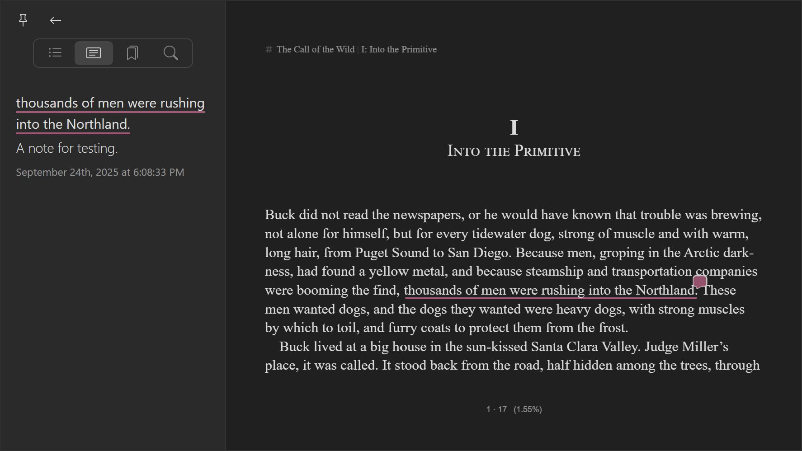

## About this repo

This repository is used for issue tracking of the Jane Reader app.

Jane Reader is not open source software, and this repository does not contain its source code.

## What is Jane Reader?

Jane Reader is an e-book reading software that currently supports the epub format. We plan to add support for more file formats.

## Downloads

You can download and use the Jane Reader app for free at https://janereader.com. Currently supported platforms include Windows 10 and above, and MacOS 12 and above.

## Screenshots

Library

 

Highlight and Note

Popup Footnote

Vertical Mode

## Features

- **EPUB Format Support**: Support the EPUB format, ensuring compatibility with a wide range of e-books.
- **Comprehensive Library Management**: Organize your entire book collection within a user-friendly library interface.
- **Book Tagging for Enhanced Organization**: Assign custom tags to books for efficient categorization and easy retrieval.
- **Import and Export Functionality**: Import your existing e-books and export your library for backup or transfer.
- **Advanced Book Search**: Quickly locate books by name or author with our powerful search functionality.
- **Light and Dark Mode Support with built-in Themes**: Offers light, dark modes, and includes 6 distinct color themes to personalize your reading experience.
- **Extensive Text Formatting Options**: Customize your reading experience by adjusting font, font size, font weight, first-line indent, character spacing, line spacing, paragraph spacing, margins, and text alignment.
- **Flexible Layout Options**: Supports single, dual, and multi-column layouts, with adjustable column width and spacing.
- **Simplified and Traditional Chinese Conversion**: Seamlessly switch between simplified and traditional Chinese characters.
- **Horizontal and Vertical Layout Support**: Read in either horizontal or vertical orientation.
- **Bookmark Management**: Add and delete bookmarks.
- **Highlighting and Notes**: Easily highlight passages and add personal notes.
- **Full-Text Search**: Quickly find specific content within your books using the full-text search feature.
- **Footnote Pop-up Display**: Footnotes are displayed in a pop-up window, allowing you to view them without leaving your current page.
- **Image Viewer**: Integrated image viewer with support for zooming and rotation.
- **Multi-Window Support**: Open each book in its own window for enhanced multitasking.

## Roadmap

- **Export Highlights & Notes:** Enable users to export their highlights and notes for sharing, archiving, or further analysis.
- **Expanded & Customizable Color Themes**: Introduce a wider selection of color themes and provide enhanced customization options to personalize the reading experience.
- **External Dictionary Integration**: Seamlessly integrate with external dictionaries to provide instant word definitions and enhance vocabulary learning.
- **Large Language Model (LLM) Integration**: Explore integration with LLMs to provide features like summarization, translation, and intelligent content analysis.
- **Third-Party App Integrations**: Expand functionality through integrations with popular apps like Obsidian, enabling users to connect their reading workflow with other tools.
- **Text-to-Speech (TTS) Support**: Add text-to-speech functionality for an accessible and engaging audio reading experience.
- **Continuous Scrolling Mode**: Introduce a continuous scrolling mode for uninterrupted reading flow.
- **Reading Statistics & Progress Tracking**: Provide users with insightful reading statistics and progress tracking to monitor their reading habits.
- **Mobile Version Development**: Extend accessibility with a dedicated mobile version for iOS and Android devices.
- **Expanded File Format Support**: Broaden compatibility by adding support for a wider range of ebook file formats.
