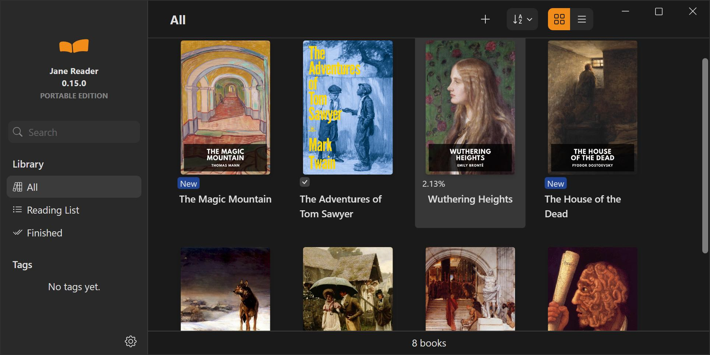
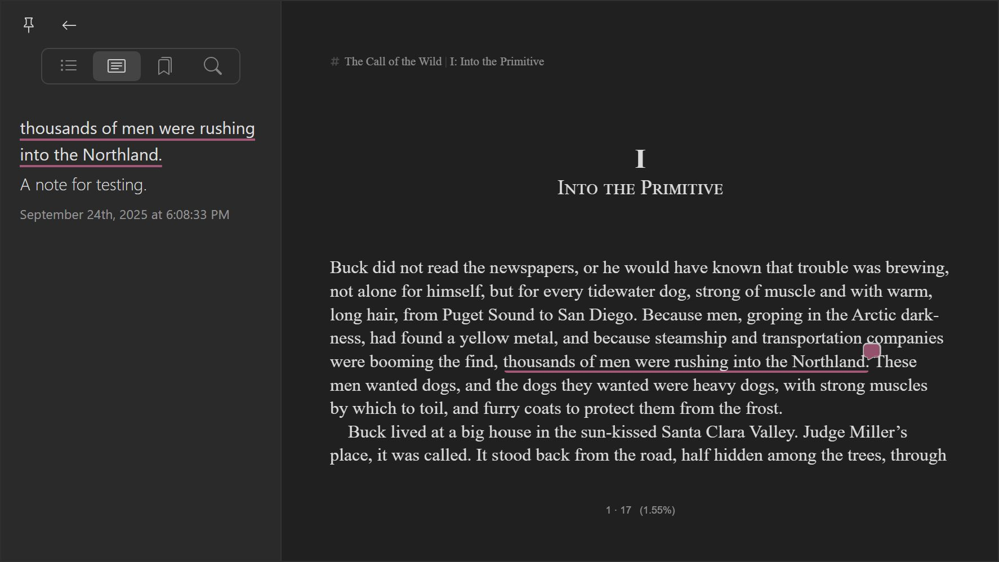
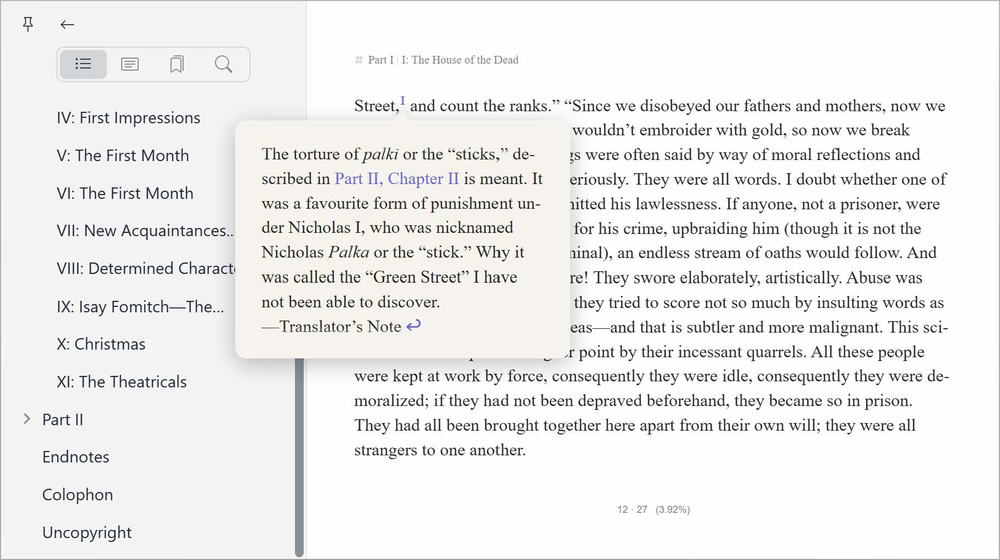

## 关于这个仓库

这个仓库用于跟踪Jane Reader应用程序的问题和开发进度。

Jane Reader并非开源软件，因此该仓库不包含其源代码。

## 什么是Jane Reader？

Jane Reader 是一款电子书阅读软件，目前支持EPUB格式。我们计划未来增加对更多文件格式的支持。

## 下载

您可以在 https://janereader.com 免费下载并使用 Jane Reader 应用程序。目前支持的平台包括 Windows 10 及以上版本，以及 MacOS 12 及以上版本。

## 屏幕截图

书库

 

高亮标记与笔记

弹出式脚注

直排模式

## 主要功能

- **EPUB格式支持**：支持 EPUB 格式，确保与各种电子书兼容。
- **全面的书库管理**：在用户友好的界面中整理您的全部书籍收藏。
- **书籍标签功能**：为书籍分配自定义标签，以便高效分类和快速查找。
- **导入与导出功能**：可以导入现有的电子书，并导出书库内容以进行备份或转移。
- **高级搜索功能**：通过强大的搜索功能，快速按书名或作者查找书籍。
- **明暗模式及多种主题**：提供明暗两种阅读模式，并包含 6 种不同的颜色主题，让您自定义阅读体验。
- **丰富的文本格式设置**：可调整字体、字体大小、字体粗细、首行缩进、字符间距、行间距、段落间距、页边距和文本对齐方式，以个性化阅读体验。
- **灵活的布局选项**：支持单栏、双栏和多栏布局，可调节栏宽和间距。
- **简体中文与繁体中文切换**：可无缝切换简体中文和繁体中文显示。
- **横排与直排支持**：支持横排和直排阅读模式。
- **书签管理**：添加和删除书签。
- **高亮标记与笔记**：轻松高亮显示文本并添加个人注释。
- **全文本搜索**：利用全文本搜索功能快速找到书中的特定内容。
- **脚注弹窗显示**：脚注会以弹窗形式显示，让您无需离开当前页面即可查看。
- **图片查看器**：内置图片查看器，支持缩放和旋转功能。
- **多窗口支持**：每本书都在独立的窗口中打开，提升多任务处理能力。

## 发展计划

- **导出高亮标记与笔记**：允许用户导出高亮标记和笔记，便于分享、归档或进一步分析。
- **扩展与可定制的主题**：提供更多颜色主题选项，并增强个性化设置功能。
- **外部词典集成**：无缝集成外部词典，提供即时单词释义，帮助提升词汇学习效果。
- **大型语言模型（LLM）集成**：探索与大型语言模型的集成，实现总结、翻译和智能内容分析等功能。
- **第三方应用集成**：通过与 Obsidian 等流行应用的集成，扩展应用程序功能，让用户能够将阅读工作流程与其他工具结合使用。
- **文本转语音（TTS）支持**：添加文本转语音功能，提供更便捷的音频阅读体验。
- **连续滚动模式**：引入连续滚动模式，实现流畅无间断的阅读体验。
- **阅读统计与进度跟踪**：提供阅读统计数据和进度跟踪功能，帮助用户了解自己的阅读习惯。
- **移动版本开发**：为 iOS 和 Android 设备开发专用移动版本，提升移动设备的可用性。
- **扩展文件格式支持**：增加对更多电子书格式的支持，提升兼容性。
